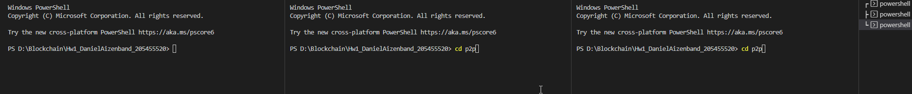

# p2p-blockchain-network

## How to install and run

- Clone the repository.
- Install modules using this command on the root folder:

```
npm install
```

- Go to secondary folder and install modules using the command:
```
cd p2p
npm install
```

- Create three terminals:



On root folder using the following command start the miner:

- ```
      node fullNodes.js 4001 4002 4003
  ```
  
On the other 2 terminal switch to the "p2p" folder:

```
cd p2p
```

then run the following commands to start the wallets:
- ```
  node walletSPV.js bob 4002 4001 4003
  ```
- ```
  node walletSPV.js alice 4003 4001 4002
  ```

## Models 
### Blockchain

```JavaScript
class Blockchain {
    constructor() {
        this.chain = [this.createGenesisBlock()];
        this.difficulty = 3;
        this.pendingTransactions = [];
        this.miningReward = 20;
    }
}
```
Defines a BlockChain with list of blocks (starting with the genesis block), pre-defined mine difficulty, an empty list for pending transactions and the mining reward.


### Block

```JavaScript
class Block {
    constructor(timestamp, transactions, previousHash = '') {
      this.previousHash = previousHash;
      this.timestamp = timestamp;
      this.transactions = transactions;
      this.nonce = 0;
      this.hash = this.calculateHash();
      this.merTree = new MerkleTree(this.transactions.map(t => t.calculateHash()), sha256)
    }
```
Each Block contains the hash of the previous block, timestamp, nonce, transactions, **a MerkleTree that holds the transactions headers for future improved accessing for finding an existing transaction.**


### Transaction

```JavaScript
 class Transaction {
    constructor(fromAddress, toAddress, amount, timestamp, signature, tip) {
      this.fromAddress = fromAddress;
      this.toAddress = toAddress;
      this.amount = amount;
      this.timestamp = timestamp ? timestamp : Date.now();
      this.signature = signature;
      this.tip = tip;
    }
```
Each transaction hold the address of the sender and reciever, the amount that is required to transfer, the signature of the miner, a timestamp and the tip

## Main flow

### Fullnodes:
```JavaScript
var topology_init = topology(self_ip, peer_ip_list).on("connection", (socket, peerIp) => {
    const peerPort = extractPortFromIp(peerIp);
    console.log('connected to peer - ', peerPort);
    sockets[peerPort] = socket;
    
    socket.on("data", (data) => {
        if (data.includes("fromAddress")) {
            var pendingTx = JSON.parse(data.toString());
            const newTransaction = new Transaction(
                pendingTx.fromAddress,
                pendingTx.toAddress,
                pendingTx.amount,
                pendingTx.timestamp,
                pendingTx.signature,
                pendingTx.tip
            );
            console.log(newTransaction);
            blockchain.addTransaction(newTransaction)
            if (blockchain.pendingTransactions.length === 3) {
                blockchain.minePendingTransactions(pubKey);
            }
        }
        if (data.includes("balance") && blockchain.pendingTransactions.length === 0) {
            console.log("pending : ", blockchain.pendingTransactions);
            console.log("bob has ", blockchain.getBalanceOfAddress(pub_key_map.get('bob')));
            console.log("alice has ", blockchain.getBalanceOfAddress(pub_key_map.get('alice')));
            console.log("miner has ", blockchain.getBalanceOfAddress(pubKey));
            console.log("Total mined coins: ", blockchain.getTotalMinedCoins());
            console.log("Total burned coins: ", blockchain.getTotalBurnedCoins());
            console.log("Total coins in network: ", blockchain.getNetworkCoins());
            exit(0);
        }
        if (data.includes("check")){ // check if data is check request.
            var checkHash = String(data).split(' ')
            var flag = blockchain.verifyTransactionExist(checkHash[1]) // validate transaction in block using merkle tree.
            socket.write(`isTransactionExist result with the hash: ${checkHash[1]} is ${flag}` ) // send back result.
        }
    });
});
```

### Wallet

```JavaScript
var topology_init = topology(myIp, peerIps).on('connection', (socket, peerIp) => {
    const peerPort = extractPortFromIp(peerIp);
    log('connected to peer - ', peerPort);

    const handleSingleTransaction = (socket) => {
        if (json_trans.transactions[idx] !== undefined) {
            if (json_trans.transactions[idx].fromAddress === name) {
                let privateKey = ec.keyFromPrivate(pri_key_map.get(name), "hex");
                const tx = new Transaction(
                    pub_key_map.get(name),
                    pub_key_map.get(name === "alice" ? "bob" : "alice"),
                    json_trans.transactions[idx].amount,
                    undefined,
                    undefined,
                    json_trans.transactions[idx].tip !== undefined ? 1 : 0
                );
                tx.signTransaction(privateKey);
                let buf = Buffer.from(JSON.stringify(tx))
                console.log(tx);
                checkHash = tx.calculateHash();
                socket.write(buf);
            }
            idx++;
            
        } else {
            if (name === "bob") {
                setTimeout(() => socket.write(`check ${checkHash}`), 3000)
                setTimeout(() => socket.write("balance"), 6000)
            }
        }
    };

    sockets[peerPort] = socket;

    if ((name === "bob") && first_sender) {
        setTimeout(() => setInterval(() => handleSingleTransaction(socket), 3000), 12500);
        first_sender = false;
    } else {
        setInterval(() => handleSingleTransaction(socket), 3000);
    }
    socket.on('data', data => log(data.toString('utf8')));
});
```


### _Additional util functions used:_

Add a new transaction to the list of pending transactions (to be added
next time the mining process starts). This verifies that the given
transaction is properly signed.

- **Mine Pending Blocks (BlockChain)**

```JavaScript
    minePendingTransactions(miningRewardAddress) {
      const total_tips = this.getSumOfTips(this.pendingTransactions);
      console.log(`Tips total amount is: ${total_tips}`);
      
      const rewardTx = new Transaction(null, miningRewardAddress , this.miningReward + total_tips, undefined, undefined, 0);
      this.pendingTransactions.push(rewardTx);
      
      let block = new Block(Date.now(), this.pendingTransactions, this.getLatestBlock().hash);
      block.mineBlock(this.difficulty);
      
      console.log('Block successfully mined!');

      this.chain.push(block);  
      this.pendingTransactions = [];
    }
```

Takes all the pending transactions, puts them in a Block and starts the
mining process. It also adds a transaction to send the mining reward to
the given address.

- **Add Transaction (BlockChain)**

```JavaScript
addTransaction(transaction) {
    if (!transaction.fromAddress || !transaction.toAddress) {
      throw new Error("Transaction must include from and to address");
    }

    // verify the transactiion.
    if (!transaction.isValid(transaction.fromAddress)) {
      throw new Error("Cannot add invalid transaction to chain");
    }

    if (transaction.amount <= 0) {
      throw new Error("Transaction amount should be higher than 0");
    }

    // Making sure that the amount sent is not greater than existing balance.
    if (
      this.getBalanceOfAddress(transaction.fromAddress) < transaction.amount
    ) {
      throw new Error("Not enough balance");
    }

    this.pendingTransactions.push(transaction);
    console.log("transaction added to pending list!");
  }
```

Add a new transaction to the list of pending transactions (to be added
next time the mining process starts). This verifies that the given
transaction is properly signed.

- **Get Balance Of Address (BlockChain)**

```JavaScript
getBalanceOfAddress(address) {
      let balance = 100;
      
      for (const block of this.chain) {
        for (const trans of block.transactions) {
          if (trans.fromAddress === address) {
            console.log(`The balance is ${balance} \nThe transaction amount is ${trans.amount} \tThe total tips ${trans.tip} \tCurrent burn is ${this.chain.indexOf(block)}`);
            balance -= Number(trans.amount) + trans.tip + this.chain.indexOf(block);    
            console.log('New balace after updating: ', balance);
          }
          if (trans.toAddress === address) {
            balance += Number(trans.amount);
          }
        }
      }
      console.log("#".repeat(15));
      console.log('The new total balance is: ', balance);
      console.log("#".repeat(15));
      return balance;
    }
```

- **Get Total Mined Coins (BlockChain)**

```JavaScript
  getTotalMinedCoins() {
      var sum = 0;
      for (const b of this.chain) {
        for (const t of b.transactions) {
          console.log(`Amount mined is: ${Number(t.amount)}, the tip is: ${t.tip}`)
          sum += Number(t.amount);
        }
      }
      return sum;
    }
```
Return the sum of all transactions amount and tip in chain.

- **Sign Transaction (Transaction)**

**Params:**
 _*keyPair*_ of the Signer
```JavaScript
signTransaction(signingKey) {
      // You can only send a transaction from the wallet that is linked to your
      // key. So here we check if the fromAddress matches your publicKey
      if (signingKey.getPublic('hex') !== this.fromAddress) {
        throw new Error('You cannot sign transactions for other wallets!');
      }
      // Calculate the hash of this transaction, sign it with the key
      // and store it inside the transaction obect
      const hashTx = this.calculateHash();
      const _signature = signingKey.sign(hashTx);
      this.signature = _signature.toDER('hex');
    }
```
Validate signer is signing for himself and then calculate transaction hash and sign
it with his private key.

- **Is Transaction Valid (Transaction)**
```JavaScript

    isValid(pub_key) {
      // If the transaction doesn't have a from address we assume it's a
      // mining reward and that it's valid. You could verify this in a
      // different way (special field for instance)
      if (this.fromAddress === null) return true;
  
      if (!this.signature || this.signature.length === 0) {
        throw new Error('No signature in this transaction');
      }
      var key = ec.keyFromPublic(pub_key, 'hex');
      if (key.verify(this.calculateHash(), this.signature)){
        console.log(`signature ${this.signature} `)
        return true
      }
      return false;
    }
  }
```
Verifies that the signature is valid - meaning that the transaction wasn't tampered.
Uses the _fromAddress_ as the public key.

- **Is Transaction Exist (BlockChain)** 
```JavaScript
  verifyTransactionExist(hash) {
      for (const b of this.chain) {
        const proof = b.merTree.getProof(hash);
        if (b.merTree.verify(proof, hash, b.merTree.getHexRoot())) return true;
      }
      return false;
    }
```


Starts the mining process on the block. It changes the 'nonce' until the hash of the block starts with enough zeros (= difficulty)

- **Mine Block**
```JavaScript
    mineBlock(difficulty) {
      while (this.hash.substring(0, difficulty) !== Array(difficulty + 1).join('0')) {
        this.nonce++;
        this.hash = this.calculateHash();
      }
      console.log(`Block mined: ${this.hash}`);
    }
```